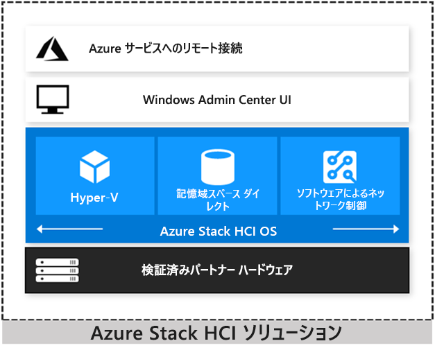

# Azure Stack HCI ソリューションの概要

Azure Stack HCI は、検証済みのハードウェアを使用して、仮想化されたワークロードをオンプレミスで実行するハイパーコンバージド Windows Server 2019 クラスターです。 また、必要に応じて、クラウドベースのバックアップ、サイトの回復などのために Azure サービスに接続することもできます。 Azure Stack HCI ソリューションでは、最適なパフォーマンスと信頼性を確保するために、Microsoft が検証したハードウェアが使用されます。 このソリューションには、NVMe ドライブ、永続メモリ、リモート ダイレクト メモリ アクセス (RDMA) ネットワークなどのテクノロジのサポートが含まれています。

Azure Stack HCI は、次の複数の製品を組み合わせたソリューションです。

- OEM パートナーからのハードウェア
- Windows Server 2019 Datacenter Edition
- Windows Admin Center
- Azure サービス (省略可能)

Azure Stack HCI は、さまざまなハードウェア パートナーから提供されている Microsoft のハイパーコンバージド ソリューションです。 ハイパーコンバージド ソリューションの次のシナリオを検討すると、Azure Stack HCI がお客様のニーズに最適なソリューションであるかどうかを判断するうえで役立ちます。

- **古いハードウェアを更新する。** 古いサーバーやストレージ インフラストラクチャを置き換え、既存の IT スキルとツールを利用して、Windows および Linux 仮想マシン (VM) をオンプレミスとエッジで実行します。

- **仮想化されたワークロードを統合する。** 効率的なハイパーコンバージド インフラストラクチャ上でレガシ アプリを統合します。 Microsoft Azure などのハイパースケール データセンターの実行に使用されるのと同じ種類のクラウドの効率性がもたらされます。

- **ハイブリッド クラウド サービスを利用するために Azure に接続する。** オフサイト バックアップ、サイトの回復、クラウドベースの監視など、Azure 内でのクラウド管理とセキュリティ サービスへのアクセスを簡素化します。

## Azure Stack ファミリ

Azure Stack HCI は、Azure と Azure Stack ファミリの一員であり、Azure Stack Hub と同じ、ソフトウェアによるコンピューティング、ストレージ、およびネットワーク ソフトウェアを利用します。 さまざまなソリューションの簡単な概要を次に示します。 詳細については、[Azure Stack エコシステムの比較](../operator/compare-azure-azure-stack.md)に関するページを参照してください。

- [Azure](https://azure.microsoft.com) - オンデマンドのセルフサービス コンピューティング リソースのためのパブリック クラウド サービスを利用して、既存のアプリを移行して最新化し、新しいクラウドネイティブ アプリを構築します。
- [Azure Stack Edge](https://docs.microsoft.com/azure/databox-online/data-box-edge-overview) - 機械学習ワークロードを加速し、オンプレミスのコンテナー化されたアプリや仮想化されたワークロードをクラウド管理アプライアンスで実行します。
- [Azure Stack HCI](https://azure.microsoft.com/overview/azure-stack/hci) - 仮想化されたアプリをオンプレミスで実行し、古くなったサーバー インフラストラクチャを交換および整理し、クラウド サービスを利用するために Azure に接続します。
- [Azure Stack Hub](../operator/azure-stack-overview.md) - 接続していない場合や、規制要件を満たすために、一貫性のある Azure サービスを使用し、クラウド アプリをオンプレミスで実行します。

詳細については、以下を参照してください。

- [Azure Stack HCI](https://azure.microsoft.com/overview/azure-stack/hci) ソリューションの Web サイトを確認する。
- Microsoft のエキスパートである Jeff Woolsey と Vijay Tewari による[新しい Azure Stack HCI ソリューションに関する説明](https://aka.ms/AzureStackOverviewVideo)を見る。

## ハイパーコンバージドの効率性

Azure Stack HCI ソリューションは、高度に仮想化されたコンピューティング、ストレージ、およびネットワークを業界標準の x86 サーバーとコンポーネント上に集約します。 リソースを同じクラスター内にまとめることで、デプロイ、管理、およびスケーリングが簡単になります。 お好みのコマンド ライン自動化か、Windows Admin Center を使用して管理します。

Microsoft クラウドの基盤となるハイパーバイザー テクノロジである Hyper-V と、NVMe、永続メモリ、リモートダイレクト メモリ アクセス (RDMA) ネットワークの組み込みサポートを備えた記憶域スペース ダイレクト テクノロジにより、お客様のサーバー アプリ向けに業界トップレベルの VM パフォーマンスを実現します。

シールドされた VM、ネットワーク マイクロセグメンテーション、ネイティブ暗号化により、アプリとデータのセキュリティを常に確保できます。

## ハイブリッド機能

パブリック クラウド内のハイパーコンバージド インフラストラクチャ プラットフォームと連携しながら、クラウドとオンプレミスを活用できます。 お客様のチームは、Azure インフラストラクチャの管理サービスへの組み込みの統合を利用して、クラウド スキルの構築を開始できます。

- Azure Site Recovery: 高可用性およびサービスとしてのディザスター リカバリー (DRaaS)。
- Azure Monitor: AI による高度な分析を使用して、お客様のアプリ、ネットワーク、インフラストラクチャ全体で起こっていることを追跡するための集中ハブ。
- Cloud Witness: Azure をクラスター クォーラム用の軽量なタイ ブレーカーとして使用。
- Azure Backup: オフサイト データ保護およびランサムウェアに対する保護を提供。
- Azure Update Management: Azure およびオンプレミスで実行されている Windows VM に対する更新プログラムの評価と更新プログラムのデプロイ。
- Azure Network Adapter: ポイント対サイト VPN 経由で、オンプレミスのリソースを Azure 内のお客様の VM に接続。
- Azure File Sync を使用して、お客様のファイル サーバーをクラウドと同期。

詳細については、「[Connecting Windows Server to Azure hybrid services (Windows Server と Azure ハイブリッド サービスの接続)](https://docs.microsoft.com/windows-server/manage/windows-admin-center/azure/index)」を参照してください。

## 管理ツールと System Center

Azure Stack HCI では、Azure Stack Hub と同じ仮想化、ソフトウェアによるストレージ、およびネットワーク ソフトウェアを使用します。 ただし、Azure Stack HCI では、お客様がクラスターに対する完全な管理者権限を持ち、そのテクノロジをすべて直接管理できます。

- [Hyper-V](https://docs.microsoft.com/windows-server/virtualization/hyper-v/hyper-v-on-windows-server)
- [記憶域スペース ダイレクト](https://docs.microsoft.com/windows-server/storage/storage-spaces/storage-spaces-direct-overview)
- [ソフトウェアによるネットワーク](https://docs.microsoft.com/windows-server/networking/sdn/)
- [フェールオーバー クラスタリング](https://docs.microsoft.com/windows-server/failover-clustering/failover-clustering-overview)

これらのテクノロジの管理には、次の管理ツールを使用できます。

- [Windows Admin Center](https://docs.microsoft.com/windows-server/manage/windows-admin-center/overview)
- [System Center](https://www.microsoft.com/cloud-platform/system-center)
- [PowerShell](https://docs.microsoft.com/powershell/?view=powershell-6)
- [サーバー マネージャー](https://docs.microsoft.com/windows-server/administration/server-manager/server-manager)や MMC スナップインなどの他の管理ツール
- 5Nine Manager などの Microsoft 以外のツール

インフラストラクチャのデプロイと管理に System Center を使用することを選択した場合は、System Center Virtual Machine Management (VMM) と System Center Operations Manager を使用します。 VMM では、VM とサービスを作成してプライベート クラウドにデプロイするために必要なリソースをプロビジョニングし、管理します。 Operations Manager では、問題を特定して早急に対応するために、お客様のエンタープライズ全体でサービス、デバイス、および操作を監視します。

## ハードウェア パートナー

Windows Server 2019 を実行する検証済みの Azure Stack HCI ソリューションは、20 社のパートナーから購入することができます。 ご希望の Microsoft パートナーがシステムの稼働開始まで担当いたしますので、設計や構築に長い時間がかかることはありません。 また、単一窓口で実装およびサポート サービスの問い合わせに対応します。

[Azure Stack HCI Web サイト](https://azure.microsoft.com/overview/azure-stack/hci)にアクセスして、現在次の Microsoft パートナーから提供されている 70 を超える Azure Stack HCI ソリューションを確認してください。ASUS、Axellio、Blue Chip、DataON、Dell EMC、Fujitsu、HPE、Hitachi、Huawei、Lenovo、NEC、primeLine Solutions、QCT、SecureGUARD、Supermicro。

## ビデオでの学習

Azure 拡張ネットワーク デオは次のとおりです。

- [Windows Server とハイブリッド ットワークを使用した Azure へのシームレスな接続](https://www.youtube.com/watch?v=do2_4Y2p9dk)

Microsoft Ignite 2019 セッションのビデオをいくつかご紹介します。

- [Microsoft Ignite Live 2019 - Azure Stack HCI の概要](https://www.youtube.com/watch?v=vueHIBqNIEU)
- [Azure Stack HCI の探索](https://www.youtube.com/watch?v=4aGZK0Ndmh8&list=PLQXpv_NQsPICdXZoH-EzlIFa4P6VS5m11&index=13&t=0s)
- [Azure Stack HCI による小売店やブランチ オフィスの最新化](https://www.youtube.com/watch?v=-JzLhjfkhmM&list=PLQXpv_NQsPICdXZoH-EzlIFa4P6VS5m11&index=9&t=0s)
- [Azure Stack HCI の新機能: 45 分で 45 の機能をご紹介](https://www.youtube.com/watch?v=C5J4IEnlS_E&list=PLQXpv_NQsPICdXZoH-EzlIFa4P6VS5m11&index=12&t=0s)
- [Azure Stack HCI のデプロイをすぐに開始する](https://www.youtube.com/watch?v=gxaPJLrWy5w&list=PLQXpv_NQsPICdXZoH-EzlIFa4P6VS5m11&index=11&t=0s)
- [データ圧縮のケース: Azure Stack HCI でのデータ重複除去](https://www.youtube.com/watch?v=fmm4iDbDiY4&list=PLQXpv_NQsPICdXZoH-EzlIFa4P6VS5m11&index=23&t=0s)
- [Azure Stack HCI のフィールドからの Dave Kawula のメモ](https://www.youtube.com/watch?v=OXv7fLlz0ew&list=PLQXpv_NQsPICdXZoH-EzlIFa4P6VS5m11&index=2&t=0s)

ハイブリッド クラウド仮想イベントのビデオをご紹介します。

- [Azure Stack HCI | ハイブリッド クラウド仮想イベント](https://www.youtube.com/watch?v=nxpoEva-R2Y)

## よく寄せられる質問

### Azure Stack Hub と Azure Stack HCI ソリューションはどのような点が共通していますか。

Azure Stack HCI ソリューションには、Azure Stack Hub と同じ、Hyper-V ベースのソフトウェアによるコンピューティング、ストレージ、ネットワーク テクノロジが搭載されています。 どちらのオファリングも、厳しいテストおよび検証基準を満たしており、信頼性および基盤となるハードウェア プラットフォームとの互換性が確保されています。

### これらはどのように違うのでしょうか。

Azure Stack Hub では、オンプレミスでクラウド サービスを運用します。 Azure IaaS および PaaS サービスをオンプレミスで実行して、一貫性を保ちながら任意の場所でクラウド アプリを構築および実行し、オンプレミスで Azure portal を使用して管理できます。

Azure Stack HCI では、仮想化されたワークロードをオンプレミスで実行し、Windows Admin Center と使い慣れた Windows Server ツールを使用して管理します。 必要に応じて、クラウドベースのサイトの回復、監視などのハイブリッド シナリオのために Azure に接続できます。

### Microsoft が HCI オファリングを Azure Stack ファミリに追加するのはなぜですか。

Microsoft のハイパーコンバージド テクノロジは既に Azure Stack Hub の基盤となっています。

Microsoft のお客様の多くは複雑な IT 環境を抱えています。Microsoft のゴールは、そうした環境に対応するソリューションを、ビジネス ニーズに合った適切なテクノロジと共に提供することです。 Azure Stack HCI は、以前は弊社のハードウェア パートナーから提供されていた Windows Server 2016 ベースの Windows Server Software-Defined (WSSD) ソリューションを進化させたものです。 これを Azure Stack ファミリに追加したのは、インフラストラクチャ管理サービスのために Azure とシームレスに接続する新しいオプションの提供を開始したからです。

### Azure Stack HCI は Azure に接続する必要がありますか。

いいえ、それは省略可能です。 オフサイトのバックアップやディザスター リカバリー、クラウドベースの監視と更新管理などのハイブリッド シナリオのために Azure との統合を活用できますが、それは省略可能です。 インターネットから切断されている状態で実行しても問題ありません。

### Azure Stack HCI は Windows Server とどのような関係になっていますか。

Windows Server 2019 は、ほぼすべての Azure 製品の基盤です。 お客様が重視している機能はすべて引き続き提供され、Windows Server 内でサポートされます。 Azure Stack HCI は、弊社のパートナーから提供され、Microsoft による検証を受けたハードウェアを使用して HCI をオンプレミスでデプロイするためのお勧めの方法です。

### Azure Stack HCI から Azure Stack Hub にアップグレードできますか。

いいえ。ただし、お客様は Azure Stack HCI から Azure Stack Hub または Azure にワークロードを移行できます。

### どの Azure サービスを Azure Stack HCI に接続できますか。

Azure Stack HCI を接続できる Azure サービスの最新一覧については、「[Connecting Windows Server to Azure hybrid services (Windows Server と Azure ハイブリッド サービスの接続)](https://docs.microsoft.com/windows-server/manage/windows-admin-center/azure/index)」をご覧ください。

### Azure Stack Hub と比較すると Azure Stack HCI のコストはどの程度になりますか。

Azure Stack Hub は、サービスとサポートを含む完全な統合システムとして販売されます。 お客様が管理するシステムとして Azure Stack Hub を購入することも、フル マネージド サービスとして弊社のパートナーから購入することもできます。 ベース システムに加えて、Azure Stack Hub または Azure 上で実行される Azure サービスは、従量課金制で販売されます。

Azure Stack HCI ソリューションは従来の購入モデルに従います。 検証済みのハードウェアは Azure Stack HCI パートナーから、ソフトウェア (ソフトウェアによるデータセンター機能と Windows Admin Center付きの Windows Server 2019 Datacenter Edition) は既存のさまざまなチャネルから購入できます。 Windows Admin Center で使用できる Azure サービスについては、Azure サブスクリプションで支払います。

### Azure Stack HCI ソリューションの購入方法を教えてください。

次の手順に従います。

1. Microsoft による検証を受けたハードウェア システムを、ご希望のハードウェア パートナーから購入します。
1. 管理、および Azure に接続してクラウド サービスを利用できるようにするために、Windows Server 2019 Datacenter Edition と Windows Admin Center をインストールします。
1. お客様の Azure アカウントを使用してクラウドベースの管理とセキュリティ サービスをお客様のワークロードに接続することもできます。

## Azure Stack Hub と Azure Stack HCI の比較

お客様の組織がデジタル変革を進める中で、パブリック クラウド サービスを使用して、最新のアーキテクチャ上に構築し、従来のアプリを更新することで、より迅速に前進できることに気付くことがあります。 ただし、技術上の障害や規制の問題などの理由により、多くのワークロードをオンプレミスに残す必要があります。 次の表は、必要なところに必要なものを提供し、ワークロードの場所に関係なくそのクラウド イノベーションを実現する Microsoft ハイブリッド クラウド戦略を判断するのに役立ちます。

| Azure Stack Hub | Azure Stack HCI |
| --------------- | --------------- |
| 新しいスキル、革新的なプロセス | 同じスキル、使い慣れたプロセス |
| お客様のデータセンター内での Azure サービス | お客様のデータセンターを Azure サービスに接続する |

### Azure Stack Hub を使用する局面

| Azure Stack Hub | Azure Stack HCI |
| --------------- | --------------- |
| 併置された複数のテナントの強力な分離および正確な使用状況の追跡とチャージバックを実現するセルフサービスのインフラストラクチャとしてのサービス (IaaS) に Azure Stack Hub を使用します。 サービス プロバイダーやエンタープライズ プライベート クラウドに最適です。 テンプレートは Azure Marketplace にあります。 | Azure Stack HCI では、マルチテナントをネイティブに適用したり、提供したりすることはありません。 |
| オンプレミスで Web Apps、Functions、Event Hubs などのプラットフォームとしてのサービス (PaaS) サービスを利用するアプリの開発と実行に Azure Stack Hub を使用します。 これらのサービスは、Azure 内とまったく同じように Azure Stack Hub 上で実行され、一貫性のあるハイブリッドの開発およびランタイム環境を提供します。 | Azure Stack HCI では、PaaS サービスをオンプレミスで実行しません。 |
| DevOps プラクティス (コードとしてのインフラストラクチャ、継続的インテグレーションと継続的デプロイ (CI/CD) など) と便利な機能 (Azure と整合性のある VM 拡張機能など) を利用したアプリのデプロイと操作の現代化に Azure Stack Hub を使用します。 開発チームや DevOps チームに最適です。 | Azure Stack HCI には、DevOps ツールがネイティブに含まれていません。 |

### Azure Stack HCI を使用する局面

| Azure Stack Hub | Azure Stack HCI |
| --------------- | --------------- |
| Azure Stack Hub には、最小 4 つのノードとそれ専用のネットワーク スイッチが必要です。 | リモート オフィスやブランチの場合に占有領域を最小限に抑えるには Azure Stack HCI を使用します。 たった 2 個のサーバー ノードとスイッチレスのバックツーバック ネットワークから開始でき、ピークがわかりやすく、価格が手頃です。 ハードウェアのオファーは、ノードあたり 4 台のドライブ、64 GB のメモリ、10,000 ドル未満からです。 |
| Azure Stack Hub では、Azure との整合性を確保するために、Hyper-V の構成機能と機能セットが制限されています。 | Exchange、SharePoint、SQL Server などの従来のエンタープライズ アプリ向けの必要最低限の Hyper-V 仮想化や、ファイル サーバー、DNS、DHCP、IIS、AD などの Windows Server ロールの仮想化に、Azure Stack HCI を使用します。 シールドされた VM など、すべての Hyper-V 機能に無制限にアクセスできます。|
| Azure Stack Hub では、これらのインフラストラクチャ テクノロジは公開されません。 | 大規模な再設計なしで、古いストレージ アレイやネットワーク アプライアンスの代わりにソフトウェアによるインフラストラクチャを使用する場合に、Azure Stack HCI を使用します。 組み込みの Hyper-V、記憶域スペース ダイレクト、およびソフトウェアによるネットワーク (SDN) は直接アクセスして管理できます。 |
