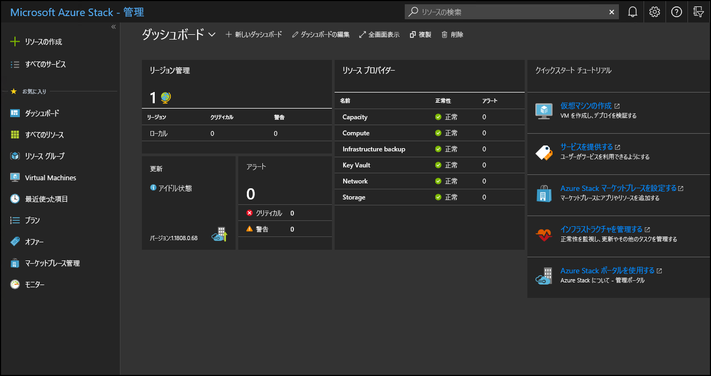

# Azure Stack Hub で管理者ポータルを使用する

Azure Stack Hub には、管理者ポータルとユーザー ポータルの 2 つのポータルがあります。 Azure Stack Hub オペレーターは、管理者ポータルを使用して Azure Stack Hub の日常的な管理と操作を行います。

## 管理者ポータルへのアクセス

管理者ポータルにアクセスするには、ポータルの URL に移動し、Azure Stack Hub オペレーターの資格情報を使用してサインインします。 統合システムの場合は、ポータルの URL は Azure Stack Hub のデプロイのリージョン名と外部 FQDN (完全修飾ドメイン名) によって異なります。 管理者ポータルの URL は、常に Azure Stack Development Kit (ASDK) のデプロイと同じです。

| 環境 | 管理者ポータルの URL |   
| -- | -- | 
| ASDK| `https://adminportal.local.azurestack.external`  |
| 統合システム | https://adminportal.&lt; *リージョン*&gt;.&lt;*FQDN*&gt; | 
| | |

> [!TIP]
> ASDK 環境の場合は、最初に、リモート デスクトップ接続または仮想プライベート ネットワーク (VPN) を使用して[開発キットのホストに接続](../asdk/asdk-connect.md)できることを確認する必要があります。

[!INCLUDE [Azure Stack Hub Operator Access Workstation](../includes/operator-note-owa.md)]

 

すべての Azure Stack Hub デプロイの既定のタイム ゾーンは、協定世界時 (UTC) に設定されます。

管理者ポータルでは、次のような操作を行うことができます。

* [Azure Stack Hub を Azure に登録する](azure-stack-registration.md)
* [マーケットプレースを設定する](azure-stack-download-azure-marketplace-item.md)
* [ユーザーのためのプラン、オファー、およびサブスクリプションを作成する](service-plan-offer-subscription-overview.md)
* [正常性とアラートの監視](azure-stack-monitor-health.md)
* [Azure Stack Hub の更新プログラムを管理する](azure-stack-updates.md)

**[クイック スタートのチュートリアル]** タイルに、最も一般的なタスクのオンライン ドキュメントへのリンクがあります。

オペレーターは、管理者ポータルで仮想マシン (VM)、仮想ネットワーク、ストレージ アカウントなどのリソースを作成することができますが、リソースを作成してテストするためには、[ユーザー ポータルにサインインする](../user/azure-stack-use-portal.md)必要があります。

>[!NOTE]
>管理者ポータルのクイックスタート チュートリアルのタイルにある **[仮想マシンの作成]** リンクから VM を作成できますが、これは Azure Stack Hub が正常にデプロイされたことを検証するときにのみ使用します。

## サブスクリプション操作の概要

管理者ポータルでは、消費、既定プロバイダー、および測定という 3 つのサブスクリプションが既定で作成されます。 オペレーターは、主に " *既定のプロバイダー サブスクリプション* " を使用します。 他のサブスクリプションを追加して管理者ポータルで使用することはできません。

その他のサブスクリプションは、管理者がユーザー用に作成するプランとオファーに基づいて、ユーザー ポータルでユーザーによって作成されます。 ただし、ユーザー ポータルでは、管理者ポータルの管理機能または運用機能のいずれにもアクセスできません。

管理者ポータルとユーザー ポータルは、Azure Resource Manager の個別のインスタンスでサポートされます。 この Azure Resource Manager による分離のため、ポータルをまたいでサブスクリプションを使用することはできません。 たとえば、Azure Stack Hub オペレーターとしてユーザー ポータルにサインインした場合は、 *既定プロバイダー サブスクリプション* にアクセスすることはできません。 管理機能にアクセスすることはできませんが、利用できる公開オファーから自分でサブスクリプションを作成することはできます。 ユーザー ポータルにサインインしている限り、テナント ユーザーと見なされます。

  >[!NOTE]
  >ASDK 環境では、ユーザーが Azure Stack Hub オペレーターと同じテナント ディレクトリに属している場合、ユーザーは管理者ポータルへのサインインをブロックされません。 ただし、ユーザーは管理機能にはアクセスできず、サブスクリプションを追加して、ユーザー ポータルで利用できるオファーにアクセスすることもできません。

## 管理者ポータルに関するヒント

### ダッシュボードのカスタマイズ

ダッシュボードには、既定のタイルのセットが含まれています。 **[ダッシュボードの編集]** を選択して既定のダッシュボードを変更したり、 **[新しいダッシュボード]** を選択してカスタムのダッシュボードを追加したりできます。 ダッシュボードにタイルを追加することもできます。 たとえば、 **[+ リソースの作成]** を選択し、 **[オファー + プラン]** を右クリックし、 **[ダッシュボードにピン留めする]** を選択します。

ポータルに空のダッシュボードが表示されることがあります。 ダッシュボードを回復するには、 **[ダッシュボードの編集]** をクリックし、右クリックして、 **[既定の状態にリセット]** を選択します。

### オンライン ドキュメントへのクイック アクセス

Azure Stack Hub オペレーター向けドキュメントにアクセスするには、管理者ポータルの右上隅にあるヘルプとサポートのアイコン (疑問符) を使用します。 カーソルをアイコンに移動し、 **[ヘルプとサポート]** を選択します。

### ヘルプとサポートへのクイック アクセス

管理者ポータルの右上隅にあるヘルプ アイコン (疑問符) をクリックし、 **[ヘルプとサポート]** をクリックしてから、 **[サポート]** で **[新しいサポート リクエスト]** をクリックすると、次のいずれかの結果になります。

- 統合システムを使用している場合は、Microsoft サポートのサポート チケットを直接開くことができるサイトが開きます。 Microsoft サポートと OEM (Original Equipment Manufacturer) ハードウェア ベンダーのサポートのどちらに連絡するかについては、「[サポートが受けられる場所](azure-stack-manage-basics.md#where-to-get-support)」を参照してください。
- ASDK を使用している場合は、[Azure Stack Hub フォーラムのサイト](https://social.msdn.microsoft.com/Forums/home?forum=AzureStack)が直接開きます。 これらのフォーラムは定期的にチェックされています。 ASDK は評価環境であるため、Microsoft サポートを通じた正式なサポートは提供されていません。

### Azure ロードマップへのクイック アクセス

管理者ポータルの右上隅にある **ヘルプとサポート** (疑問符) を選択し、 **[Azure ロードマップ]** を選択すると、新しいブラウザー タブが開き、Azure ロードマップが表示されます。 **[製品]** 検索ボックスに「 **Azure Stack Hub** 」と入力すると、すべての Azure Stack Hub ロードマップの更新プログラムを確認できます。

## 次のステップ

[Azure Stack Hub を Azure に登録](azure-stack-registration.md)し、ユーザーに提供する項目を [Azure Stack Hub Marketplace](azure-stack-marketplace.md) に設定します。
