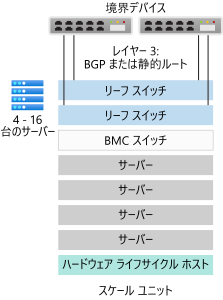
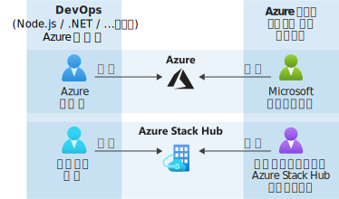

# Azure Stack Hub の概要

Azure Stack Hub は、オンプレミス環境でアプリを実行し、データセンターで Azure サービスを実現する方法を提供する Azure の拡張機能です。 一貫性のあるクラウド プラットフォームにより、組織は、テクノロジの制約に基づいてビジネスを決定するのではなく、ビジネスの要件に基づいて自信を持ってテクノロジを決定できます。

## Azure Stack Hub を使用する理由

Azure によって、開発者が最新アプリを構築するための機能豊富なプラットフォームが提供されます。 ただし、一部のクラウドベースのアプリは、待機時間、間欠的な接続、規制などの障害に直面します。 Azure と Azure Stack Hub によって、顧客向けアプリと社内の基幹業務アプリのどちらにも対応する、新しいハイブリッド クラウドのユース ケースが実現します。

- **エッジおよび非接続ソリューション**。 Azure Stack Hub でローカルで処理したデータを Azure で集計したあと、さらに詳しく分析し、Azure Stack Hub と Azure の両方で共通するアプリのロジックを使用して、待機時間や接続性の要件に対応できます。 インターネットから切断された状態で、Azure に接続せずに Azure Stack Hub を展開することもできます。 例としては 工場、クルーズ船、立坑などがあります。

- **さまざまな規制に対応するクラウド アプリ**。 Azure でアプリの開発とデプロイを行えば、Azure Stack Hub 上のオンプレミスにデプロイする完全な柔軟性が得られ、規制やポリシーの要件に対応できます。 コードの変更は不要です。 アプリの例としては、グローバルな監査、財務報告書の作成、外国為替取引、オンライン ゲーム、経費報告書の作成が挙げられます。

- **オンプレミスのクラウド アプリ モデル**。 Azure のサービス、コンテナー、サーバーレス、マイクロサービスの各アーキテクチャを使用して、既存のアプリの更新と拡張を行うか、新しいアプリを構築することができます。 クラウドの Azure と Azure Stack Hub オンプレミスとの間で一貫性のある DevOps プロセスを使用し、コア ミッションクリティカル アプリのアプリ最新化を迅速に行います。

## Azure Stack Hub のアーキテクチャ

Azure Stack Hub 統合システムは、信頼できるパートナーによって構築された 4 - 16 のサーバー ラックで構成され、データセンターに直接納入されます。 納入後は、ソリューション プロバイダーによって統合システムが展開され、Azure Stack Hub ソリューションがビジネス要件に合っていることが確認されます。 必要なすべての電源や冷却装置、境界接続、およびその他の必要なデータセンター統合要件が整っていることを確認してデータセンターを準備できます。

> Azure Stack Hub とデータ センターの統合エクスペリエンスの詳細については、「[Azure Stack Hub とデータセンターの統合](azure-stack-customer-journey.md)」を参照してください。

Azure Stack Hub は、業界標準のハードウェアに構築され、Azure サブスクリプションの管理に既に使用しているのと同じツールを使用して管理されます。 その結果、Azure に接続しているかどうかに関係なく、一貫した DevOps プロセスを適用できます。

Azure Stack Hub アーキテクチャを使うと、インターネットから切断された遠隔地や接続が間欠的な場合など、エッジで Azure サービスを提供できます。 データを Azure Stack Hub でローカルに処理してから、追加の処理や分析のために Azure に集約するハイブリッド ソリューションを作成できます。 さらに、Azure Stack Hub はオンプレミスにインストールされるため、コードを変更せずにクラウド アプリをオンプレミスに柔軟に展開でき、特定の規制やポリシー要件を満たすことができます。

## デプロイ オプション

Azure Stack Hub 統合システムはマイクロソフトとハードウェア パートナーのパートナーシップによって提供され、クラウドと歩調を合わせた革新と、コンピューティングの管理のしやすさを両立させたソリューションを実現します。 Azure Stack Hub は統合されたハードウェアおよび ソフトウェア システムとして提供されているため、必要な柔軟性やコントロールが得られるほか、クラウドから革新を図ることができます。

Azure Stack Hub 統合システムのサイズは 4 から 16 サーバーの範囲で指定できます (通称 "*スケール ユニット*")。 統合システムは、ハードウェア パートナーと Microsoft によって共同でサポートされます。 次の図は、スケール ユニットの一例を示しています。 

。 

<!---add info and image on regions, etc--->

### 接続モデル

Azure Stack Hub をインターネット (および Azure) に**接続した状態**で展開するか、**接続していない状態**で展開するかを選択できます。 

> 詳しくは、[接続されている](azure-stack-connected-deployment.md)展開モデルと[接続されていない](azure-stack-disconnected-deployment.md)展開モデルの考慮事項をご覧ください。

### ID プロバイダー 

Azure Stack Hub では、Azure Active Directory (Azure AD) または Active Directory フェデレーション サービス (AD FS) のいずれかを使用します。 Azure AD は、マイクロソフトが提供するクラウドベースのマルチテナント対応 ID プロバイダーです。 展開がインターネットに接続されているほとんどのハイブリッド シナリオでは、ID ストアとして Azure AD を使用します。

Azure Stack Hub の切断されたデプロイの場合は、AD FS を使用する必要があります。 Azure Stack Hub リソース プロバイダーおよびその他のアプリは、AD FS または Azure AD で同様に動作します。 Azure Stack Hub には、独自の Active Directory インスタンスと、Active Directory Graph API が含まれています。

## Azure Stack Hub の管理方法

Azure Stack Hub では、Azure と同じ操作モデルが使用されます。 Azure Stack Hub オペレーターは、Microsoft がテナント ユーザーに Azure サービスを提供するのと同様の方法で、さまざまなサービスやアプリをテナント ユーザーに提供できます。 

Azure Stack Hub は、管理者ポータル、ユーザー ポータル、または [PowerShell](/powershell/azure/azure-stack/overview?view=azurestackps-1.7.1) で管理することができます。 Azure Stack Hub のポータルは、それぞれが Azure Resource Manager の個別のインスタンスでサポートされています。 **Azure Stack Hub オペレーター**は、管理者ポータルを使用して Azure Stack Hub を管理し、テナント オファリングの作成などの操作を行い、統合システムの正常性の維持や状態の監視を行います。 ユーザー ポータルでは、仮想マシン (VM) やストレージ アカウント、Web アプリなどのクラウド リソースを消費するためのセルフサービス エクスペリエンスが提供されます。

> 管理者ポータルを使用した Azure Stack Hub の管理について詳しくは、[Azure Stack Hub 管理ポータルのクイック スタート](azure-stack-manage-portals.md)のページをご覧ください。

Azure Stack Hub オペレーターは、[VM](./tutorial-offer-services.md?view=azs-2002)、[Web アプリ](azure-stack-app-service-overview.md)、高可用性 [SQL Server](azure-stack-tutorial-sql.md)、[MySQL Server](azure-stack-tutorial-mysql.md) データベースを提供できます。 また、[Azure Stack Hub クイックスタートの Azure Resource Manager テンプレート](https://github.com/Azure/AzureStack-QuickStart-Templates)を使用して、SharePoint や Exchange などを展開できます。

オペレーターは、[管理者ポータル](azure-stack-manage-portals.md)または [PowerShell](/powershell/azure/azure-stack/overview?view=azurestackps-1.7.1) を使って Azure Stack Hub を管理できます。 プラン、クォータ、オファー、およびサブスクリプションを使用してテナントに[サービスを提供](service-plan-offer-subscription-overview.md)するように Azure Stack Hub を構成できます。 テナント ユーザーは複数のオファーにサブスクライブできます。 オファーは 1 つまたは複数のプランを含むことができ、プランは 1 つまたは複数のサービスを含むことができます。 さらに、オペレーターは、容量を管理し、アラートに対処します。

ユーザーは、オペレーターが提供するサービスを使用します。 ユーザーは、サブスクライブしたサービス (Web アプリ、Storage、VM など) のプロビジョニング、監視、管理を行うことができます。 ユーザーは、ユーザー ポータルまたは PowerShell を使って Azure Stack Hub を管理できます。

> どこでどのアカウントを使用するか、通常のオペレーターの役割、ユーザーに何を伝えるか、ヘルプを利用する方法など、Azure Stack Hub の管理について詳しくは、「[Azure Stack Hub の管理の基本](azure-stack-manage-basics.md)」をご覧ください。

## リソース プロバイダー

リソース プロバイダーは、Azure Stack Hub のあらゆる IaaS サービスと PaaS サービスの基盤となる Web サービスです。 Azure Resource Manager は、さまざまなリソース プロバイダーに依存して、サービスへのアクセスを提供しています。 各リソース プロバイダーを使用して、それぞれのリソースを構成および制御できます。 サービス管理者は、新しいカスタム リソース プロバイダーを追加することもできます。

### 基本のリソース プロバイダー

基本の IaaS リソース プロバイダーは 3 つあります。

- **コンピューティング**:コンピューティング リソース プロバイダーでは、Azure Stack Hub テナントが独自の VM を作成できます。 コンピューティング リソース プロバイダーには、VM と VM 拡張機能を作成する機能があります。 VM 拡張機能サービスは、Windows および Linux の VM で使用する IaaS 機能を提供します。 たとえば、コンピューティング リソース プロバイダーを使用して Linux VM をプロビジョニングし、デプロイ中に Bash スクリプトを実行して VM を構成できます。
- **ネットワーク リソース プロバイダー**:ネットワーク リソース プロバイダーは、プライベート クラウドでソフトウェアによるネットワーク制御 (SDN) およびネットワーク機能の仮想化 (NFV) に使用する一連の機能を提供します。 ネットワーク リソース プロバイダーを使用して、ソフトウェア ロード バランサー、パブリック IP、ネットワーク セキュリティ グループ、仮想ネットワークなどのリソースを作成できます。
- **ストレージ リソース プロバイダー**:ストレージ リソース プロバイダーによって、一貫性のある 4 つの Azure ストレージ サービス ([blob](/azure/storage/common/storage-introduction#blob-storage)、[queue](/azure/storage/common/storage-introduction#queue-storage)、[table](/azure/storage/common/storage-introduction#table-storage)、[Key Vault](/azure/key-vault/)) のアカウント管理が提供され、シークレット (パスワードや証明書) の管理と監査が提供されます。 ストレージ リソース プロバイダーは、Azure との一貫性があるストレージ サービスのサービス プロバイダーによる管理を容易にするためのストレージ クラウド管理サービスも提供します。 Azure Storage には柔軟性があり、ドキュメントやメディア ファイルなどの大量の構造化されていないデータは Azure BLOB により、構造化された NoSQL ベースのデータは Azure テーブルにより格納と取得が行われます。

### オプションのリソース プロバイダー

Azure Stack Hub に展開して使用できるオプションの PaaS リソース プロバイダーは 3 つあります。

- **App Service**: [Azure App Service on Azure Stack Hub](azure-stack-app-service-overview.md) は、Azure Stack Hub で利用できる Microsoft Azure の、PaaS サービスです。 このサービスにより、内部または外部の顧客はあらゆるプラットフォームやデバイス用の Web、API、Azure Functions アプリを作成できるようになります。
- **SQL Server**:[SQL Server リソース プロバイダー](azure-stack-sql-resource-provider.md)を使用して、SQL データベースを Azure Stack Hub のサービスとして提供します。 リソース プロバイダーをインストールし、それを 1 つ以上の SQL Server インスタンスに接続した後で、クラウドネイティブ アプリ、SQL を使用する Web サイト、SQL を使用する他のワークロードのためにデータベースを作成できます。
- **MySQL サーバー**:[MySQL サーバー リソース プロバイダー](azure-stack-mysql-resource-provider-deploy.md)を使用して、MySQL データベースを Azure Stack Hub サービスとして公開します。 MySQL リソース プロバイダーは、Windows Server 2019 Server Core VM 上でサービスとして実行されます。

## 次のステップ

[Azure Stack Hub ポートフォリオを比較する](compare-azure-azure-stack.md)

[管理の基本](azure-stack-manage-basics.md)

[クイック スタート: Azure Stack Hub 管理ポータルを使用する](azure-stack-manage-portals.md)

[使用量と課金を理解する](azure-stack-usage-reporting.md)
