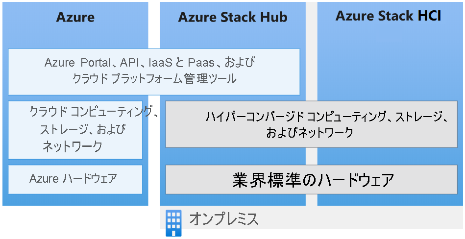

# グローバル Azure、Azure Stack Hub、および Azure Stack HCI の違い

Microsoft では 1 つの Azure エコシステムで Azure と Azure Stack Hub サービス ファミリを提供しています。 業務でグローバル Azure とオンプレミス リソースのどちらを使用しているかに関係なく、Azure Resource Manager で同じアプリケーション モデル、セルフサービス ポータル、API を使用して、クラウドベースの機能を提供します。

この記事では、グローバル Azure、Azure Stack Hub、および Azure Stack HCI の機能の違いについて説明します。 組織で Microsoft クラウドベースのサービスを実現するための最適な選択を行うときに役立つ一般的なシナリオの推奨事項を示します。

## グローバル Azure

Microsoft Azure は、ビジネス上の課題への対応を支援するために絶えず拡大を続けるクラウド サービスの集合体です。 世界規模の巨大なネットワークに対し、お気に入りのツールやフレームワークを使ってアプリを自在に構築、管理、デプロイすることができます。

グローバル Azure では、世界 54 の地域で 100 を超えるサービスが提供されています。 グローバル Azure サービスの最新の一覧については、「[*リージョン別の利用可能な製品*](https://azure.microsoft.com/regions/services)」を参照してください。 Azure で利用可能なサービスがカテゴリ別に一覧表示され、一般提供かプレビューかも示されます。

グローバル Azure サービスについて詳しくは、[Azure の作業開始](/azure/?panel=get-started1&pivot=get-started)に関するページをご覧ください。

## Azure Stack Hub

Azure Stack Hub は Azure を拡張したもので、クラウド コンピューティングの俊敏性やイノベーションをオンプレミス環境にもたらします。 オンプレミスに展開した Azure Stack Hub を使用すると、インターネット (および Azure) に接続した環境でも、インターネット接続のない切断された環境でも、一貫性がある Azure のサービスを提供できます。 Azure Stack Hub はグローバル Azure と同じ基盤テクノロジを使用します。これには、コア コンポーネントである、サービスとしてのインフラストラクチャ (IaaS)、サービスとしてのソフトウェア (SaaS)、およびオプションのサービスとしてのプラットフォーム (PaaS) の機能が含まれます。 次のような機能があります。

- Azure VM (Windows および Linux 用)
- Azure Web Apps および Azure Functions
- Azure Key Vault
- Azure Resource Manager
- Azure Marketplace
- Containers
- 管理ツール (プラン、オファー、RBAC など)

Azure Stack Hub は Microsoft ではなくお客様によって運用されるため、Azure Stack Hub の PaaS 機能はオプションです。 つまり、基礎となるインフラストラクチャおよびプロセスをエンド ユーザーから離して抽象化する準備ができている場合は、必要な PaaS サービスをエンド ユーザーに提供できます。 ただし、Azure Stack Hub には、App Service、SQL データベース、MySQL データベースなど、いくつかのオプションの PaaS サービス プロバイダーが含まれています。 これらはリソース プロバイダーとして提供されているため、マルチテナントに対応し、標準の Azure Stack Hub 更新プログラムによって時間経過に応じて更新され、Azure Stack Hub ポータルに表示され、Azure Stack Hub と一体化しています。

上記のリソース プロバイダーに加えて、その他の PaaS サービスが IaaS で実行する [Azure Resource Manager テンプレートベースのソリューション](https://github.com/Azure/AzureStack-QuickStart-Templates)として提供されテストされています。 Azure Stack Hub オペレーターとして、ユーザーに次のような PaaS サービスとして提供することができます。

- Service Fabric
- Kubernetes コンテナー サービス
- Ethereum ブロックチェーン
- Cloud Foundry

### Azure Stack Hub のユース ケース例

- 財務モデリング
- 臨床データおよび診療報酬データ
- IoT デバイス分析
- 小売の品揃えの最適化
- サプライチェーンの最適化
- 産業用 IoT
- 予測的なメンテナンス
- スマート シティ
- 市民エンゲージメント

Azure Stack Hub についての詳細は、「[Azure Stack Hub とは](azure-stack-overview.md)」で確認してください。

## Azure Stack HCI

[Azure Stack HCI](../hci/overview.md) は、検証済みのハードウェアを使用して仮想化された Windows と Linux のワークロードをオンプレミスで実行し、クラウドベースのバックアップ、復旧、監視のために Azure に簡単に接続する、ハイパーコンバージド クラスターです。 Azure Stack HCI は、最初は Windows Server 2019 が基になっていましたが、今では、サブスクリプション ベースのライセンス モデルとハイブリッド機能が組み込まれた Azure サービスとして提供されています。 Azure Stack HCI は、Windows Server と同じコア オペレーティング システム コンポーネントに基づいていますが、最適な仮想化ホストとなることに重点が置かれたまったく新しい製品ラインです。

Azure Stack HCI では、最適なパフォーマンスと信頼性を確保するために、Microsoft による検証済みの OEM パートナーのハードウェアが使用されています。 このソリューションには、NVMe ドライブ、永続メモリ、リモート ダイレクト メモリ アクセス (RDMA) ネットワークなどのテクノロジのサポートが含まれています。

### Azure Stack HCI のユース ケース例

- リモート オフィスまたはブランチ オフィスのシステム
- データセンターの統合
- 仮想デスクトップ インフラストラクチャ
- ビジネスに不可欠なインフラストラクチャ
- 記憶域のコスト削減
- クラウドの高可用性と障害復旧
- SQL Server のようなエンタープライズ アプリの仮想化

[Azure Stack HCI Web サイト](https://azure.microsoft.com/overview/azure-stack/hci/)にアクセスして、現在 Microsoft パートナーから提供されている 70 を超える Azure Stack HCI ソリューションを確認してください。

## 次のステップ

[Azure Stack Hub の管理の基本](azure-stack-manage-basics.md)

[クイック スタート: Azure Stack Hub 管理ポータルを使用する](azure-stack-manage-portals.md)
