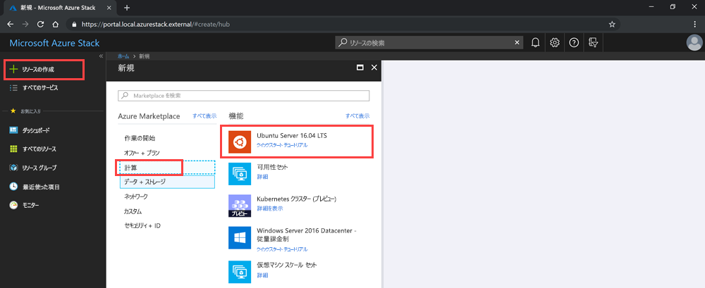

# <a name="deploy-a-linux-vm-to-host-a-web-app-in-azure-stack"></a>Web アプリをホストする Linux VM を Azure Stack にデプロイする

Web フレームワークを使って作成されたご自分の Web アプリをホストする基本的な Linux VM を、Marketplace にある Ubunutu イメージを利用して作成し、デプロイできます。 この VM では、以下を使用して Web アプリをホストできます。

- **Python**。 一般的な Python Web フレームワークには、Flask、Bottle、Django があります。
- **Go**。 一般的な Go フレームワークには、Revel、Martini、Gocraft/web、Gorilla があります。 
- **Ruby**. ご自分の Ruby Web アプリを配信するためのフレームワークとして Ruby on Rails を設定できます。 
- **Java**. Java を使用すると、Apache Tomcat サーバーにポストする Web アプリを開発できます。 Tomcat を Linux にインストールし、サーバーに直接ご自分の Java WAR ファイルを配置できます。 

この記事の手順を使用して、Linux OS を使用する任意の Web アプリ、フレームワーク、およびバックエンド テクノロジを稼働させることができます。 その後、アプリのメンテナンス タスクを処理するために、Azure Stack を使用して、ご使用のインフラストラクチャと、ご使用のテクノロジ内の管理ツールを管理できます。

## <a name="deploy-a-linux-vm-for-a-web-app"></a>Web アプリ用の Linux VM をデプロイする

秘密鍵を作成し、Linux VM のベース イメージを使用して、VM の特定の属性を指定した後、VM を作成します。 VM が作成されたら、VM を操作し、VM がアプリをホストするために必要なポートを開きます。 DNS 名も作成します。 最後に、VM に接続し、apt-get を使用してマシンを更新します。 このハウツー記事が終わったら、ご使用の Azure Stack 内の VM でご自分の Web アプリがホストされています。

すぐに手順に進むことも、必要なものがすべてそろっているかを確認することもできます。

## <a name="prerequisites-and-considerations"></a>前提条件と考慮事項

- Azure Stack サブスクリプションが必要です。
- ご使用のサブスクリプションが **Ubuntu Server 16.04 LTS** イメージにアクセスできる必要があります。 それよりも新しいバージョンのイメージを使用できますが、これらの手順は 16.04 LTS を念頭に置いて書かれています。 このイメージをお持ちでない場合は、お客様のクラウド オペレーターにイメージを Azure Stack Marketplace に追加するよう依頼してください。

<!-- Azure Stack specific considerations

### Authentication

Azure Stack works with two identity management services, Azure Active Directory (Azure AD) and Active Directory Federated Services (AD FS).  This section addresses how this procedure will work with either version.

### Connectivity

Azure Stack can be run in connected to completely disconnected scenarios. This section addresses considerations about the use case in relation to connectivity.

### Azure Stack Development Kit and Integrated Systems

While the two version of the product are the same product both version behave differently. Call out considerations about either version. 

### Azure Stack version

Place any version specific calls outs. The procedure will contain steps for the latest version. This section will contain call outs for previous version that are still supported. -->

## <a name="deploy-vm-using-the-portal"></a>ポータルを使用して VM をデプロイする

Putty などのアプリを使用して、ご自分のサーバー用の SSH 公開キーを作成します。 ご使用の Azure Stack ポータルにアクセスし、Ubuntu サーバーを追加します。 ご使用のネットワークおよび DNS エントリを設定します。 ご自分のサーバーに接続して更新します。

### <a name="create-your-vm"></a>VM の作成

1. ご自分のサーバー用の SSH 公開キーを作成します。 詳細については、「[SSH 公開キーの使用方法](azure-stack-dev-start-howto-ssh-public-key.md)」を参照してください。
2. ご使用の Azure Stack ポータルを開きます。
3. **[リソースの作成]** > **[Compute]** > **[Ubuntu Server 16.04 LTS]** の順に選択します。

    

4. **[仮想マシンの作成]** ブレードの **[1.基本設定の構成]** で以下を実行します。
    1. **ご自分の VM の名前**を入力します。
    1. **[VM ディスクの種類]** で **[Premium SSD]** と **[Standard HDD]** のどちらかを選択します。
    1. ご自分の**ユーザー名**を入力します。
    1. **[認証の種類]** で **[SSH 公開キー]** を選択します。
    1. 作成した SSH 公開キーを取得します。 それをテキスト エディターで開き、キーをコピーして、**[SSH 公開キー]** ボックスに貼り付けます。 `---- BEGIN SSH2 PUBLIC KEY ----` から `---- END SSH2 PUBLIC KEY ----` までのテキストを含めます。 テキストのブロック全体をキー ボックスに貼り付けます。
       ```text  
            ---- BEGIN SSH2 PUBLIC KEY ----
            Comment: "rsa-key-20190207"
            <Your key block>
            ---- END SSH2 PUBLIC KEY ----```
    1. Select your Azure Stack subscription.
    1. Create a new **Resource group** or use an existing depending on how you want to organize the resources for your app.
    1. Select your location. The ASDK is usually in a **local** region. The location will depend on your Azure Stack.
1. For **2. Size** type:
    - Select the size of data and RAM for your VM that is available in your Azure Stack.
    - You can either browse the list or filter for the size of your VM by **Compute type**, **CPUs**, and storage space.
    - Prices presented are estimates in your local currency that include only Azure infrastructure costs and any discounts for the subscription and location. The prices don't include any applicable software costs. Recommended sizes are determined by the publisher of the selected image based on hardware and software requirements.
    - Using a standard disk rather than a premium disk could impact operating system performance.

1. in **3. Configure optional** features type:
    1. For **High availability,** you can select an availability set. To provide redundancy to your application, you can group two or more virtual machines in an availability set. This configuration ensures that during a planned or unplanned maintenance event, at least one virtual machine will be available and meet the 99.95% Azure SLA. The availability set of a virtual machine can't be changed after it is created.
    1. For **Storage** select **Premium disks (SSD)** or **Standard disks (HDD)**. Premium disks (SSD) are backed by solid-state drives and offer consistent, low-latency performance. They provide the best balance between price and performance, and are ideal for I/O-intensive applications and production workloads. Standard disks (HDD) are backed by magnetic drives and are preferable for applications where data is accessed infrequently. Zone- redundant disks are backed by Zone redundant storage (ZRS) that replicates your data across multiple zones and are available even if a single zone is down. 
    1. You can select **Use managed disks**. Enable this feature to have Azure automatically manage the availability of disks to provide data redundancy and fault tolerance, without creating and managing storage accounts on your own. Managed disks may not be available in all regions. For more information, see [Introduction to Azure managed disks](https://docs.microsoft.com/azure/virtual-machines/windows/managed-disks-overview).
    1. Select **virtual network** to configure your network. Virtual networks are logically isolated from each other in Azure. You can configure their IP address ranges, subnets, route tables, gateways, and security settings, much like a traditional network in your data center. Virtual machines in the same virtual network can access each other by default. 
    1. Select **subnet** to configure your subnet. A subnet is a range of IP addresses in your virtual network, which can be used to isolate virtual machines from each other or from the Internet. 
    1. Select **Public IP address** to configure access to your VM or services running on your VM. Use a public IP address if you want to communicate with the virtual machine from outside the virtual network. 
    1. Select **Network Security Group**, **Basic, or **Advanced**. Set rules that allow or deny network traffic to the VM 
    1. Select **public inbound ports** to set access for common or custom protocols to your VM. The service specifies the destination protocol and port range for this rule. You can choose a predefined service, like RDP or SSH, or provide a custom port range.  
        For the  web server, you are going to want to HTTP (80), HTTPS (443), and SSH (22) open. If you plan on managing the machine with an RDP connection, open port 3389.
    1. Select **Extensions** if you would like to add Extension to your VM. Extensions add new features, like configuration management or antivirus protection, to your virtual machine using extensions. 
    1. Disable or enable **Monitoring**. Capture serial console output and screenshots of the virtual machine running on a host to help diagnose startup issues. 
    1. Select **diagnostics storage account** to specify the storage account holding your metrics. Metrics are written to a storage account so you can analyze them with your own tools. . 
    1. Select **OK**.
1. Review **4. Summary**:
    - The portal validates your settings.
    - You can download the Azure Resource Manager template for your VM if you would like to reuse your settings with an Azure Resource Manager workflow.
    - Press **OK** when the validation has passed. The deployment of the VM takes several minutes.

### Specify the open ports and DNS name

You will want to make your web app accessible to users on your network by opening the ports used to connect to the machine and adding a friendly DNS name such as `mywebapp.local.cloudapp.azurestack.external` that users can use in their web browsers.

#### Open inbound ports

You can modify the destination protocol and port range for predefined service, like RDP or SSH or provide a custom port range. For example, you may want to work with the port range of your web framework. GO, for instance, communicates on port 3000.

1. Open the Azure Stack portal for your tenant.
1. Find your VM. You may have pinned the VM to your dashboard, or you can search for the VM in the **Search resources** box.
1. Select **Networking** in your VM blade.
1. Select **Add inbound port** rule to open a port.
1. For Source, leave the default to **Any**.
1. For Source port range, leave the wildcard (*).
1. For Destination port range, add the port you would like to open, such as `3000`.
1. For **Protocol** leave **Any**.
1. For **Action** set to **Allow**.
1. For **Priority** leave for the default.
1. Type a **Name** and **Description** to help you remember why the port is open.
1. Select **Add**.

#### Add a DNS name for your server

In addition, you can create a DNS name for your server, and then users can connect to your web site using a URL.

1. Open the Azure Stack portal for your tenant.
1. Find your VM. You may have pinned the VM to your dashboard, or you can search for the VM in the **Search resources** box.
1. Select **Overview**.
1. Select **Configure** under VM.
1. Select **Dynamic** for **Assignment**.
1. Type the DNS name label such as `mywebapp` so that your full URL will be: `mywebapp.local.cloudapp.azurestack.external` (for an ASDK app).

### Connect via SSH to update your VM

1. On the same network as your Azure Stack, open your SSH client. For more information, see [How to use an SSH public key](azure-stack-dev-start-howto-ssh-public-key.md).
1. Type:
    ```bash  
        sudo apt-get update
        sudo apt-get -y upgrade
    ```

<!--

## Deploy VM using the PowerShell

Include a sentence or two to explain only what is needed to complete the procedure.

1. Step one of the procedures.

    | Parameter | Example | Description |
    | --- | --- | --- |
    | item      | "dog"   | Describe what it is and where to find the information. |

2. Step two of the procedure

    ```PowerShell  
    verb-command -item "dog"
    ```

3. Step three of the procedures.

    ```PowerShell  
    verb-command -item "dog"
    ```

4. Step four of the procedures.

    ```PowerShell  
    verb-command -item "dog"
    ```

## Deploy VM using the CLI

Include a sentence or two to explain only what is needed to complete the procedure.

1. Step one of the procedures.

    | Parameter | Example | Description |
    | --- | --- | --- |
    | item      | "dog"   | Describe what it is and where to find the information. |

2. Step two of the procedure

    ```CLI  
    verb-command -item "dog"
    ```

3. Step three of the procedures.

    ```CLI  
    verb-command -item "dog"
    ```

4. Step four of the procedures.

    ```CLI  
    verb-command -item "dog"
    ```

-->

## <a name="next-steps"></a>次の手順

[Azure Stack 向けの開発](azure-stack-dev-start.md)方法の詳細を確認する