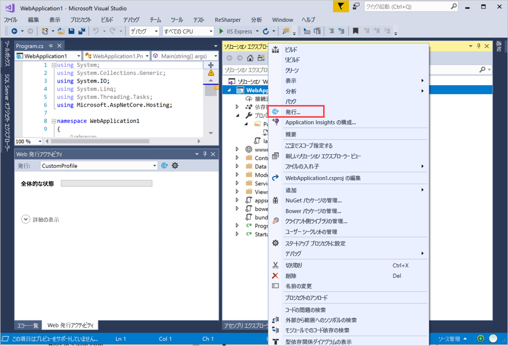
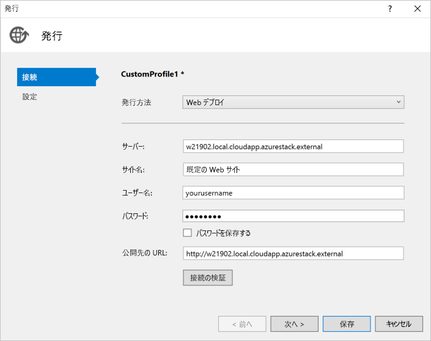

# <a name="deploy-a-c-aspnet-web-app-to-a-vm-in-azure-stack-hub"></a>Azure Stack Hub 内の VM に C# ASP.NET Web アプリをデプロイする

Azure Stack Hub 内にご自分の C# ASP.NET Web アプリをホストする仮想マシン (VM) を作成できます。 この記事では、サーバーを設定し、C# ASP.NET Web アプリをホストするようサーバーを構成して、Visual Studio から直接ご自分のアプリをデプロイするときの手順について説明します。

この記事では、Windows 2016 サーバー上で実行されている ASP.NET Core 2.2 を使用する C# 6.0 アプリを使用します。

## <a name="create-a-vm"></a>VM の作成

1. [Windows Server VM](azure-stack-quick-windows-portal.md) を作成します。

1. VM に (管理コンソールを含む) IIS および ASP.NET 4.6 コンポーネントをインストールするには、次のスクリプトを実行します。

    ```PowerShell  
    # Install IIS (with Management Console)
    Install-WindowsFeature -name Web-Server -IncludeManagementTools
    
    # Install ASP.NET 4.6
    Install-WindowsFeature Web-Asp-Net45
    
    # Install Web Management Service
    Install-WindowsFeature -Name Web-Mgmt-Service
    ```

1. [Web 配置 v3.6](https://www.microsoft.com/download/details.aspx?id=43717) をダウンロードします。 MSI ファイルからインストールし、すべての機能を有効にします。

1. ご自分のサーバーに .NET Core 2.2 Hosting Bundle をインストールします。 手順については、[.NET Core インストーラー](https://dotnet.microsoft.com/download/dotnet-core/2.2)に関するページを参照してください。 ご使用の開発用マシンとターゲット サーバーの両方で同じバージョンの .NET Core を使用していることを確認してください。

1. Azure Stack Hub ポータルで、ご自分の VM のネットワーク設定に示されているポートを開きます。

    a. ご自分のテナントの Azure Stack Hub ポータルを開きます。

    b. ご自分の VM を検索します。 ダッシュボードに VM をピン留めしている場合があります。また、 **[リソースの検索]** ボックスで検索することもできます。

    c. **[ネットワーク]** を選択します。

    d. VM の下の **[受信ポートの規則を追加する]** を選択します。

    e. 次のポートのインバウンド セキュリティ規則を追加します。

    | Port | Protocol | 説明 |
    | --- | --- | --- |
    | 80 | HTTP | ハイパーテキスト転送プロトコル (HTTP) は、サーバーからの Web ページの配信に使用されるプロトコルです。 クライアントは、DNS 名または IP アドレスを使用して HTTP 経由で接続されます。 |
    | 443 | HTTPS | ハイパーテキスト転送プロトコル セキュア (HTTPS) は、セキュリティ証明書を要求し、情報の暗号化された転送を許可する、セキュリティで保護されたバージョンの HTTP です。  |
    | 22 | SSH | Secure Shell (SSH) は、セキュリティで保護された通信のための暗号化されたネットワーク プロトコルです。 SSH クライアントとのこの接続を使用して、VM を構成し、アプリをデプロイします。 |
    | 3389 | RDP | 省略可能。 リモート デスクトップ プロトコルは、リモート デスクトップ接続を介して、マシンのグラフィック ユーザー インターフェイスを使用できるようにします。   |
    | 8172 | Custom | WebDeploy で使用されるポート。 |

    各ポートに対して、次を実行します。

    a. **[ソース]** で **[すべて]** を選択します。

    b. **[発信元ポート範囲]** に、アスタリスク ( **\*** ) を入力します。

    c. **[宛先]** で **[すべて]** を選択します。

    d. **[宛先ポート範囲]** で、開くポートを追加します。

    e. **[プロトコル]** で **[すべて]** を選択します。

    f. **[アクション]** で、 **[許可]** を選択します。

    g. **[優先度]** で、既定の選択項目のままにします。

    h. ポートが開いている理由を思い出せるように**名前**と**説明**を入力します。

    i. **[追加]** を選択します。

1.  Azure Stack Hub 内にあるご自分の VM の **[ネットワーク]** 設定で、ご自分のサーバーの DNS 名を作成します。 ユーザーはこの URL を使用してお客様の Web サイトに接続できます。

    a. ご自分のテナントの Azure Stack Hub ポータルを開きます。

    b. ご自分の VM を検索します。 ダッシュボードに VM をピン留めしている場合があります。また、 **[リソースの検索]** ボックスで検索することもできます。

    c. **[概要]** を選択します。

    d. **[VM]** の下の **[構成]** を選択します。

    e. **[割り当て]** で **[動的]** を選択します。

    f. 完全な URL が *mywebapp.local.cloudapp.azurestack.external* になるように、**mywebapp** などの DNS 名ラベルを入力します。

## <a name="create-an-app"></a>アプリを作成する 

ご自分の Web アプリを使用することも、[Visual Studio を使用した Azure への ASP.NET Core アプリの発行](/aspnet/core/tutorials/razor-pages/razor-pages-start?tabs=visual-studio&view=aspnetcore-2.2)に関するページの例を使用することもできます。 この記事では、Visual Studio 2017 の Azure Virtual Machines 発行機能を使用して、ASP.NET Web アプリを作成して Azure 仮想マシンに発行する方法について説明します。 インストールし、ご自分のアプリがローカルで実行されていることを確認したら、発行ターゲットをご使用の Azure Stack Hub インスタンス内の Windows VM に更新します。

## <a name="deploy-and-run-the-app"></a>アプリのデプロイと実行

Azure Stack Hub 内のご自分の VM への発行ターゲットを作成します。

1. **ソリューション エクスプローラー**で、ご自分のプロジェクトを右クリックし、 **[発行]** を選択します。

    

1. **[発行]** ウィンドウで、 **[新しいプロファイル]** を選択します。
1. **[IIS]、[FTP] など**を選択します。
1. **[発行]** を選択します。
1. **[発行方法]** で **[Web 配置]** を選択します。
1. **[サーバー]** で、以前に定義した DNS 名 (*w21902.local.cloudapp.azurestack.external* など) を入力します。
1. **[サイト名]** に、「**Default Web Site**」と入力します。
1. **[ユーザー名]** に、マシンのユーザー名を入力します。
1. **[パスワード]** に、マシンのパスワードを入力します。
1. **[接続先 URL]** に、サイトの URL (*mywebapp.local.cloudapp.azurestack.external* など) を入力します。

    

1. ご自分の Web 配置の構成を検証するには、 **[接続の検証]** を選択し、 **[次へ]** を選択します。
1. **[構成]** を **[リリース]** に設定します。
1. **[ターゲット フレームワーク]** を **[netcoreapp2.2]** に設定します。
1. **[ターゲット ランタイム]** を **[ポータブル]** に設定します。
1. **[保存]** を選択します。
1. **[発行]** を選択します。
1. ご自分の新しいサーバーに移動します。 実行中のご自分の Web アプリケーションを確認できます。

    ```http  
        mywebapp.local.cloudapp.azurestack.external
    ```

## <a name="next-steps"></a>次のステップ

- [Azure Stack Hub 内で開発環境を設定する](azure-stack-dev-start.md)方法について学習する。
- [IaaS としての Azure Stack Hub 向けの一般的なデプロイ](azure-stack-dev-start-deploy-app.md)を確認する。
- C# プログラミング言語の詳細および C# の他のリソースについては、「[C# のガイド](/dotnet/csharp/)」を参照してください。
