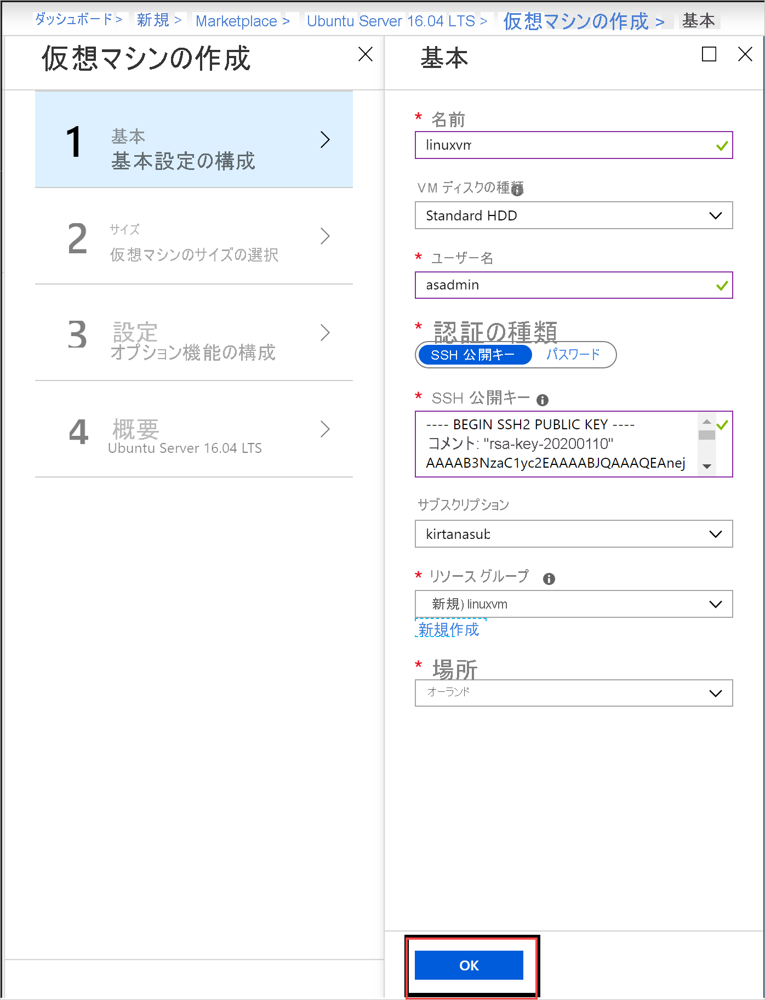
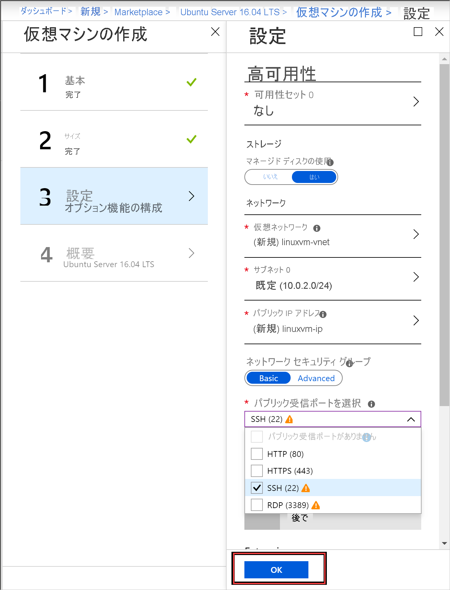

# <a name="quickstart-create-a-linux-server-vm-by-using-the-azure-stack-hub-portal"></a>クイック スタート:Azure Stack Hub ポータルを使用して Linux サーバー VM を作成する

Azure Stack Hub ポータルを使用して、Ubuntu Server 16.04 LTS 仮想マシン (VM) を作成できます。 この記事では、仮想マシンを作成し、使用します。 この記事では、次の方法についても説明します。

* リモート クライアントを使用して VM に接続する。
* NGINX Web サーバーをインストールする。
* リソースをクリーンアップする。

> [!NOTE]  
> この記事の画像は、Azure Stack Hub バージョン 1808 で導入された変更に合わせて更新されています。 バージョン 1808 では、アンマネージド ディスクに加え、"*マネージド ディスク*" の使用のサポートが追加されています。 以前のバージョンを使用している場合、ディスクの選択など、一部のタスクの画像が実際の UI に表示されるものと異なります。  

## <a name="prerequisites"></a>前提条件

* Azure Stack Hub Marketplace 内の Linux イメージ

   Azure Stack Hub Marketplace には、既定では Linux イメージがありません。 必要な Ubuntu Server 16.04 LTS イメージを Azure Stack Hub オペレーターに提供してもらってください。 オペレーターは、[Azure から Azure Stack Hub への Marketplace の項目のダウンロード](../operator/azure-stack-download-azure-marketplace-item.md)に関する記事の手順を使用できます。

* SSH クライアントへのアクセス

   Azure Stack Development Kit (ASDK) を使用している場合は、Secure Shell (SSH) クライアントにアクセスできない可能性があります。 クライアントが必要な場合は、いくつかのパッケージに SSH クライアントが含まれています。 たとえば、PuTTY には SSH クライアントと SSH キー ジェネレーター (puttygen.exe) が含まれています。 利用できるパッケージの詳細については、[SSH 公開キーの使用方法](azure-stack-dev-start-howto-ssh-public-key.md)に関するページを参照してください。

* このクイック スタートでは、PuTTY を使用して SSH キーを生成し、Linux サーバー VM に接続します。 [PuTTY をダウンロードしてインストールします](https://www.putty.org)。

## <a name="create-an-ssh-key-pair"></a>SSH キー ペアの作成

この記事のすべての手順を完了するには、SSH キーの組が必要です。 既存の SSH キーの組がある場合は、この手順をスキップできます。

SSH キーの組を作成するには:

1. PuTTY のインストール フォルダー (既定の場所は *C:\Program Files\PuTTY*) に移動し、次を実行します。

    `puttygen.exe`

1. **[PuTTY Key Generator]** ウィンドウで、 **[Type of key to generate]\(生成するキーの種類\)** を **[RSA]** に、 **[Number of bits in a generated key]\(生成されるキーのビット数\)** を **[2048]** に設定します。

   

1. **[Generate] \(生成)** を選択します。

1. キーを生成するために、 **[Key]\(キー\)** ボックス内でポインターをランダムに動かします。

1. キーの生成が完了したら、 **[Save public key]\(公開キーを保存する\)** を選択してから、 **[Save private key]\(秘密キーを保存する\)** を選択してキーをファイルに保存します。

   

## <a name="sign-in-to-the-azure-stack-hub-portal"></a>Azure Stack Hub ポータルにサインインする

Azure Stack Hub ポータルのアドレスは、接続している Azure Stack Hub 製品によって異なります。

* ASDK の場合は、`https://portal.local.azurestack.external` に移動します。

* Azure Stack Hub 統合システムの場合は、Azure Stack Hub オペレーターによって提供された URL に移動します。

## <a name="create-the-vm"></a>VM の作成

1. **[リソースの作成]**  >  **[Compute]** の順に選択します。 `Ubuntu Server 16.04 LTS` を検索します。 名前を選択します。

   

1. **［作成］** を選択します

   

1. VM 情報を入力します。 [認証の種類] で **[SSH 公開キー]** を選択し、保存した SSH 公開キーを貼り付け、 **[OK]** を選択します。

    > [!NOTE]  
    > キーの先頭または末尾の空白を必ず削除してください。

   

1. VM のサイズとして **[D1_V2]** を選択します。

> [!Note]  
> GPU 対応 VM を作成している場合は、VM サイズとして GPU VM **[NC_v3]** または **[NC4as_T4_v3]** を選択します。

   

1. **[設定]** ブレードで既定値への変更を入力します。マネージド ディスクを使用します。 SSH アクセスを許可する必要がある場合は **[SSH (22)]** を選択してポートを開きます。 お使いの構成の準備が整ったら、 **[OK]** を選択します。

   

1. [概要] で **[OK]** を選択して、VM のデプロイを開始します。 **[仮想マシン]** を選択して新しい VM を確認し、VM 名を検索して、検索結果でその VM を選択します。


## <a name="connect-to-the-vm"></a>VM に接続します

1. VM ページで **[接続]** を選択します。 VM に接続するために必要な SSH 接続文字列を見つけることができます。 

1. **[PuTTY Configuration]\(PuTTY 構成\)** ページの **[Category]\(カテゴリ\)** ウィンドウで、下へスクロールして、 **[SSH]** を展開し、 **[Auth]\(認証\)** を選択します。 

   

1. **[Browse]\(参照\)** を選択し、保存した秘密キー ファイルを選択します。

1. **[Category]\(カテゴリ\)** ウィンドウで、上へスクロールし、 **[Session]\(セッション\)** を選択します。

1. **[Host Name (or IP address)]\(ホスト名 (または IP アドレス)\)** ボックスに、Azure Stack Hub ポータルに表示されている接続文字列を貼り付けます。 この例では、この文字列は *asadmin@192.168.102.34* です。

1. **[Open]\(開く\)** を選択して、VM のセッションを開きます。

   

## <a name="install-the-nginx-web-server"></a>NGINX Web サーバーのインストール

パッケージ ソースを更新し、VM 上に最新の NGINX パッケージをインストールするために、次の bash コマンドを入力します。

```bash
#!/bin/bash

# update package source
sudo apt-get -y update

# install NGINX
sudo apt-get -y install nginx
```

NGINX のインストールが完了したら、SSH セッションを閉じて Azure Stack Hub ポータルの VM の **[概要]** ページを開きます。

## <a name="open-port-80-for-web-traffic"></a>Web トラフィック用にポート 80 を開く

受信トラフィックと送信トラフィックのセキュリティは、ネットワーク セキュリティ グループ (NSG) で確保します。 Azure Stack Hub ポータルから VM が作成されると、SSH 接続用のポート 22 上の受信規則が作成されます。 この VM は Web サーバーをホストするため、ポート 80 上で Web トラフィックを許可するには NSG 規則を作成する必要があります。

1. VM の **[概要]** ページで、**リソース グループ** の名前を選択します。

1. VM の **ネットワーク セキュリティ グループ** を選択します。 NSG は **[種類]** 列を使用して識別できます。

1. 左側のウィンドウの **[設定]** で **[受信セキュリティ規則]** を選択します。

1. **[追加]** を選択します。

1. **[名前]** ボックスに「**http**」と入力します。 

1. **[ポート範囲]** が 80 に設定されていることと、 **[アクション]** が **[許可]** に設定されていることを確認します。

1. **[OK]** を選択します。

## <a name="view-the-welcome-to-nginx-page"></a>[Welcome to nginx]\(nginx へようこそ\) ページを表示する

NGINX がインストールされ、VM 上のポート 80 が開かれたので、その VM のパブリック IP アドレスを使用して Web サーバーにアクセスできます (パブリック IP アドレスは VM の **[概要]** ページに表示されます)。

Web ブラウザーを開いて､*http://\<public IP address>* に移動します｡


## <a name="clean-up-resources"></a>リソースをクリーンアップする

不要になったリソースをクリーンアップします。 VM とそのリソースを削除するには、VM ページでリソース グループを選択し、 **[削除]** を選択します。

## <a name="next-steps"></a>次のステップ

このクイック スタートでは、Web サーバーがインストールされた基本の Linux サーバー VM をデプロイしました。 Azure Stack Hub VM の詳細については、[Azure Stack Hub の VM の考慮事項](azure-stack-vm-considerations.md)に関する記事に進んでください。
