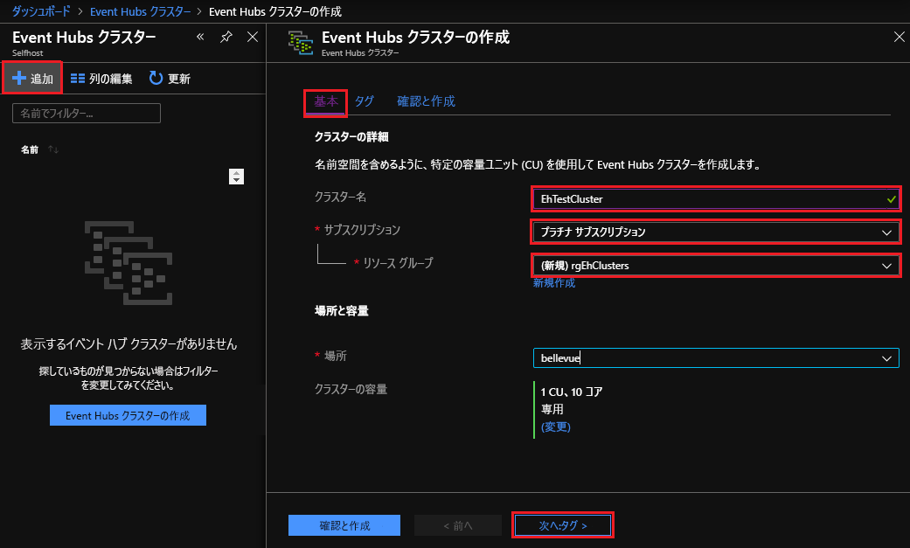
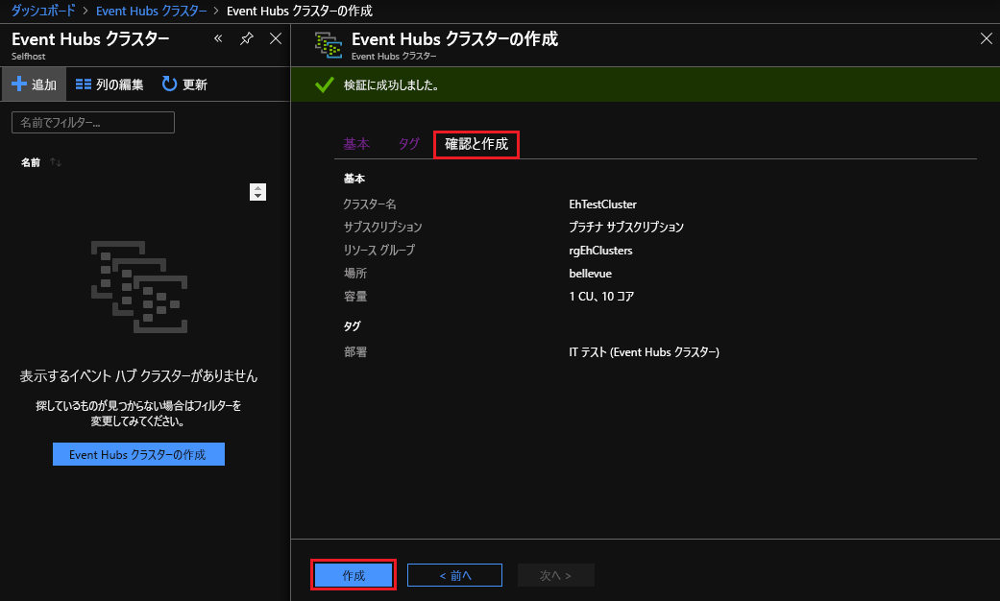
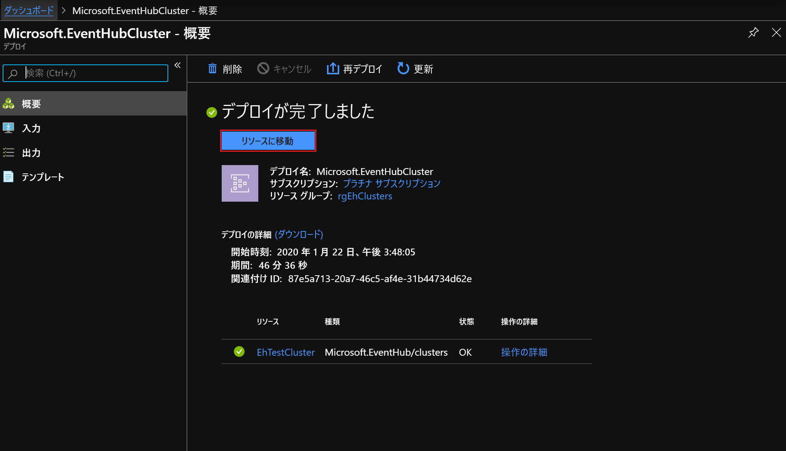
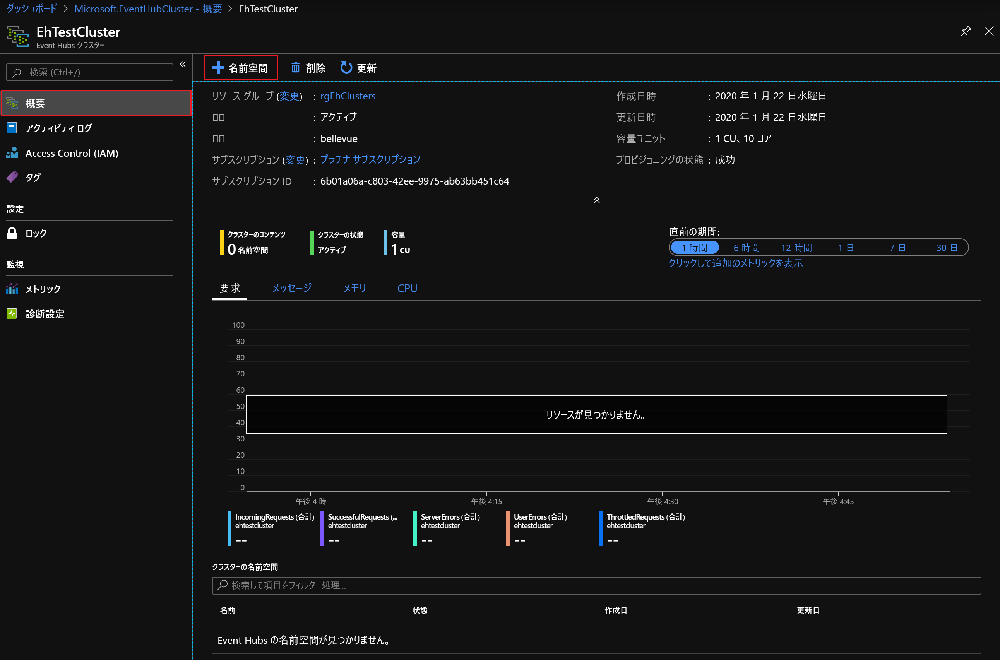
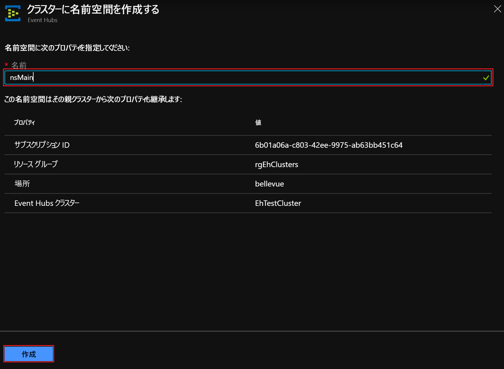
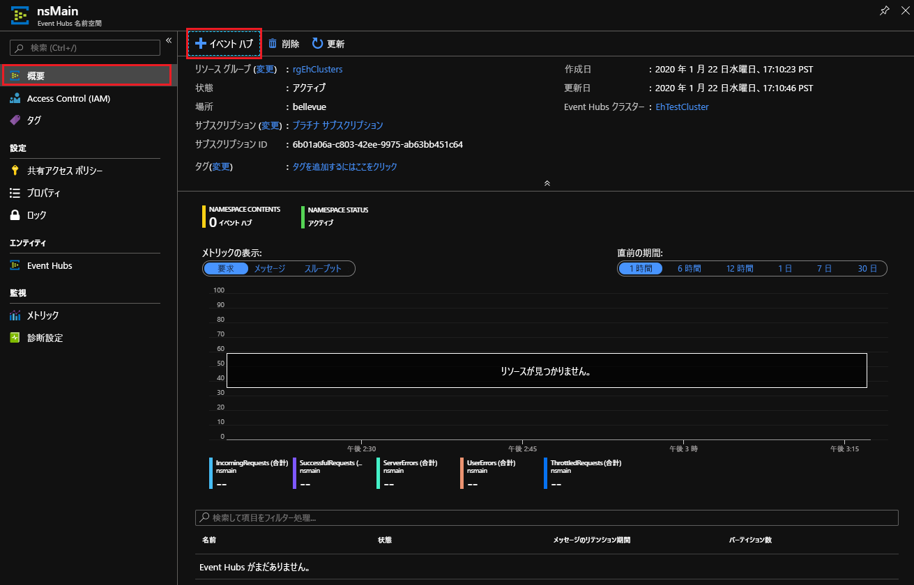
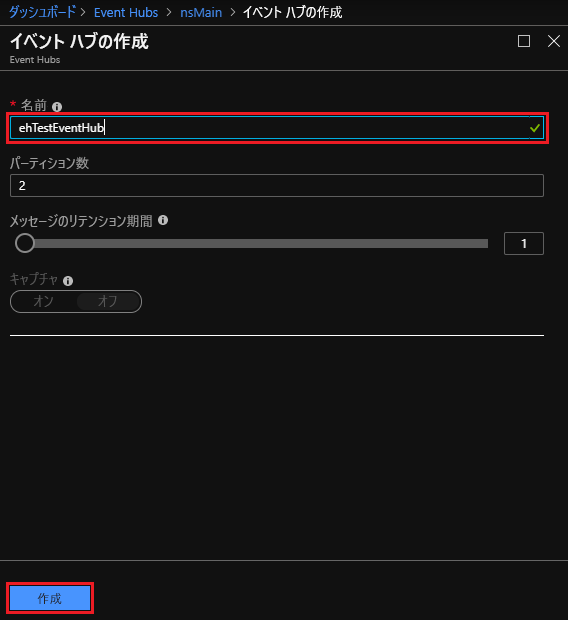
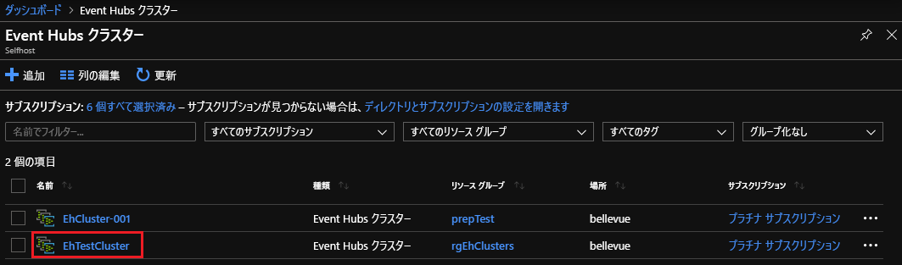
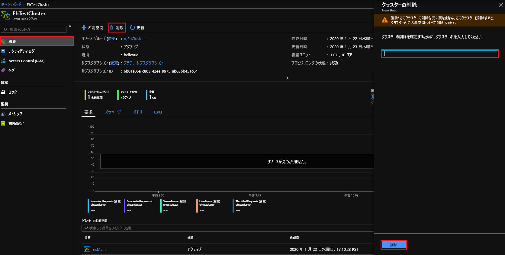

# クイック スタート:Azure Stack Hub ポータルを使用して Event Hubs クラスターを作成する

[!INCLUDE [preview-banner](../includes/event-hubs-preview.md)]

このクイックスタートでは、Azure Stack Hub のユーザー ポータルを使用して Event Hubs クラスターを作成する方法について説明します。 

Event Hubs クラスターは、最も厳しいストリーミングのニーズに応えるシングルテナント デプロイを提供します。 Event Hubs クラスターでは、1 秒あたり数百万のイベントを、保証された容量と 1 秒未満の待ち時間でイングレスすることができます。 Event Hubs クラスターには、一般的なすべての機能と、Azure Event Hubs エディションで提供されている機能と密接に関連するパリティが含まれています。

## 前提条件

このクイックスタートを完了するには、Event Hubs サービスがサブスクリプションで使用可能であることを確認する必要があります。 そうでしない場合は、管理者と協力して [Azure Stack Hub リソース プロバイダーに Event Hubs をインストール](../operator/event-hubs-rp-overview.md)します。 インストールのステップには、Event Hubs サービスを含むオファーの作成も含まれます。 

オファーが利用できるようになったら、管理者はサブスクリプションを作成または更新して Event Hubs を含めることができます。 [新しいオファーをサブスクライブして、独自のサブスクリプションを作成する](azure-stack-subscribe-services.md)こともできます。

## 概要

Event Hubs クラスターは、容量ユニット (CU) を指定することによって作成されます。 CU は、事前に割り当てられた CPU、ストレージ、メモリ リソースの量です。 Event Hubs クラスターは CPU/時間で課金されます。 クラスターで使用されるコアの数 (CPU) は、クラスター作成のエクスペリエンスで CU の数 (クラスターのサイズ) を選択すると表示されます。 クラスター リソースの使用の詳細については、「[How to do capacity planning for Event Hubs on Azure Stack Hub](../operator/event-hubs-rp-capacity-planning.md)」(Azure Stack Hub で Event Hubs の容量計画を行う方法) を参照してください。 

このクイックスタートでは、Azure Stack Hub のユーザー ポータルを使用して次を行う方法について説明します。
- 1 CU の Event Hubs クラスターを作成する。
- クラスターに名前空間を作成する。
- 名前空間にイベント ハブを作成する。
- Event Hubs クラスターを削除する

## Event Hubs クラスターを作成する

Event Hubs クラスターは、1 つ以上の名前空間を作成できる固有のスコープ コンテナーを提供します。 Event Hubs を作成するには、次のステップを実行します。 

1. Azure Stack Hub のユーザー ポータルにサインインします。
2. 左側のナビゲーション ウィンドウで  **[すべてのサービス]**   を選択し、検索バーに「Event Hubs クラスター」と入力して、結果の一覧から **[Event Hubs クラスター]** の項目を選択します。
3. **[Event Hubs クラスター]** のページで、上部のメニューから **[+ 追加]** を選択します。 右側に **[Event Hubs クラスターの作成]** パネルが開きます。
4.  **[Event Hubs クラスターの作成]**   ページの **[基本]** タブで、次の操作を行います。  
   - **[クラスター名]** : 名前を入力します。 その名前が使用できるかどうかがすぐに自動で確認されます。 使用できる場合は、フィールドの右端にチェックマークが表示されます。 
   - **サブスクリプション**:クラスターを作成するサブスクリプションを選択します。 
   - **[リソース グループ]** :クラスターを作成するリソース グループを作成/選択します。 
   - ページ下部の  **[次へ: タグ >]**   を選択して続行します。 システムがリソースを完全にプロビジョニングするまで待機しなければならない場合があります。 

   

5.  **[タグ]** タブで、次の操作を行います。 
   - 必要に応じて、リソース タグの名前と値のペアを入力します。  
   - ページ下部の  **[次へ: 確認と作成]**  を選択して続行します。 

   

6.  **[確認と作成]** タブには、ページの上部に "検証に成功しました" というバナーも表示されます。 詳細を確認し、クラスターを作成する準備ができたら  **[作成]** を選択します。 

   

   >[!NOTE]
   > Event Hubs クラスターのデプロイは、完了するまでに数分かかることがあります (通常は 45 分以上)。

7. デプロイ中は、 **[デプロイが進行中です]** の状態ページが表示されます。 デプロイが完了すると、ページが **[デプロイが完了しました]** に変わります。 次のセクションに進む前に、 **[リソースに移動]** を選択して新しいクラスターを表示します。

   

## 名前空間の作成

ここで、新しいクラスター内に名前空間を作成します。

1. **[Event Hubs クラスター]** の **概要** ページで、上部のメニューから  **[+ 名前空間]**   を選択します。 

   

2. **[クラスター内に名前空間を作成する]** パネルで、次の操作を行います。

   - **Name**:名前空間の名前を入力します。 その名前が使用できるかどうかがすぐに自動で確認されます。 使用できる場合は、フィールドの右端にチェックマークが表示されます。 
   - **プロパティ/値のリスト**:名前空間は次のプロパティを継承します。 
     - サブスクリプション ID 
     - Resource group 
     - 場所 
     - クラスター名 

   -  **[作成]**   を選択して名前空間を作成します。

   

3. **[クラスターの名前空間]** の下に新しい名前空間があることを確認してください。 次のセクションに進む前に、新しい名前空間のリンクを選択します。 

   

## イベント ハブの作成

1. **[Event Hubs 名前空間]** の **概要** ページで、上部のメニューから **[+ Event Hub]** を選択します。  

   

2. **[イベント ハブの作成]** パネルで、次の操作を行います。
   - **Name**:イベント ハブの名前を入力します。 名前に使用できるのは、文字、数字、ピリオド、ハイフン、アンダースコアのみです。 名前の最初と最後は、文字か数字にする必要があります。 その名前が使用できるかどうかがすぐに自動で確認されます。 使用できる場合は、フィールドの右端にチェックマークが表示されます。
   -  **[作成]**   を選択してイベント ハブを作成します。

   

## Event Hubs クラスターを削除する

クラスターを削除するには:

1. 左側のナビゲーション ウィンドウから  **[すべてのサービス]**   をクリックします。 検索バーに「Event Hubs クラスター」と入力して、結果の一覧から **[Event Hubs クラスター]** の項目を選択します。
2. **[Event Hub クラスター]** ページで、前に作成したクラスターを探して選択します。

   

3. **[Event Hubs クラスター]** の **概要** ページで、次の操作を行います。
   - 上部のメニューから  **[削除]**   を選択します。  
   - 右側に **[クラスターの削除]** パネルが開き、削除の確認メッセージが表示されます。 
   - クラスターの名前を入力し、 **[削除]**   をクリックしてクラスターを削除します。 

   

## 次のステップ

このクイックスタートでは、ポータルを使用して Event Hubs クラスターを作成する方法について説明しました。 次は、"イベントの送受信" のクイックスタートに進みます。まずはこちらから始めましょう。  

> [!div class="nextstepaction"]
> [Event Hubs との間でイベントを送受信する](/azure/event-hubs/get-started-dotnet-standard-send-v2)
